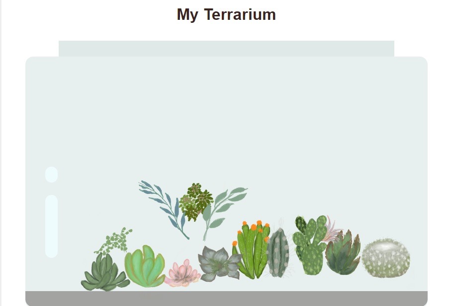

## Virtual Terrarium

### HTML Challenge

https://developer.mozilla.org/en-US/docs/Web/HTML/Element/marquee

### CSS Challenge

Add a 'bubble' shine to the left bottom area of the jar to make it look more glasslike. You will be styling the .jar-glossy-long and .jar-glossy-short to look like a reflected shine.

### DOM Manipulation and a Closure Challenge

Add new event handler to your closure to do something more to the plants; for example, double-click a plant to bring it to the front.

##

